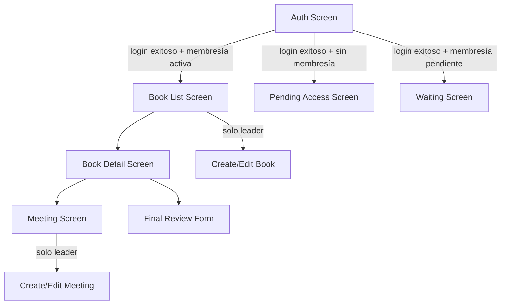
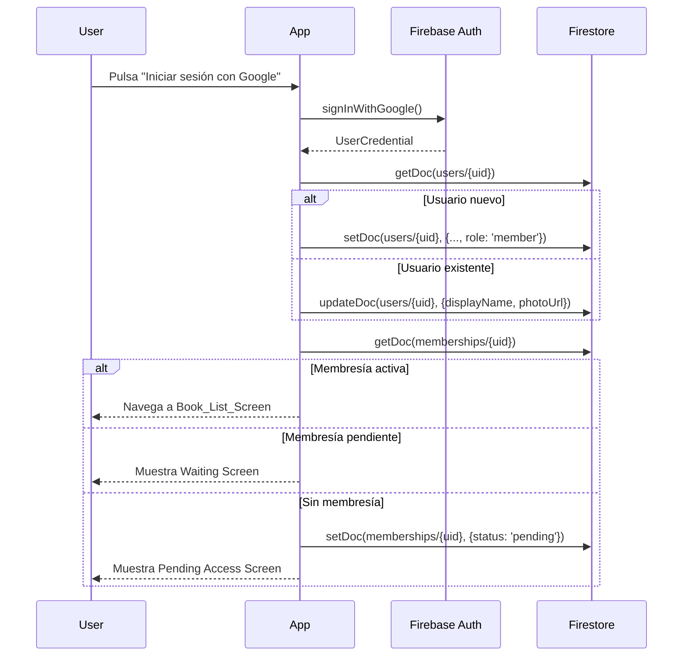

# Design Document: Book Club App

## Overview

Book Club App es una aplicación móvil Flutter con backend Firebase que permite a los miembros de un club de lectura gestionar libros, reuniones, comentarios, calificaciones y reseñas finales. La arquitectura sigue el patrón **Repository + BLoC/Provider** para separar la lógica de negocio de la UI, con Firebase como backend (Authentication, Firestore y Storage).

### Stack tecnológico

- **Frontend**: Flutter (Dart)
- **Autenticación**: Firebase Authentication + Google Sign-In
- **Base de datos**: Cloud Firestore
- **Almacenamiento**: Firebase Storage
- **Gestión de estado**: BLoC (flutter_bloc) o Riverpod
- **Testing de propiedades**: `fast_check` (Dart) o `glados` (Dart PBT library)

---

## Architecture

La aplicación sigue una arquitectura en capas:

```
┌─────────────────────────────────────────┐
│              Presentation Layer          │
│  (Screens, Widgets, BLoC/Cubit)         │
├─────────────────────────────────────────┤
│              Domain Layer                │
│  (Use Cases, Entities, Repositories)    │
├─────────────────────────────────────────┤
│           Data Layer                     │
│  (Firebase Services, DTOs, Mappers)     │
└─────────────────────────────────────────┘
```



### Flujo de autenticación y acceso



---

## Components and Interfaces

### Servicios principales

#### AuthService
```dart
abstract class AuthService {
  Future<UserCredential> signInWithGoogle();
  Future<void> signOut();
  Stream<User?> get authStateChanges;
}
```

#### UserRepository
```dart
abstract class UserRepository {
  Future<AppUser?> getUser(String uid);
  Future<void> createUser(AppUser user);
  Future<void> updateUser(String uid, Map<String, dynamic> fields);
}
```

#### BookRepository
```dart
abstract class BookRepository {
  Stream<List<Book>> watchBooks();
  Future<Book?> getBook(String bookId);
  Future<String> createBook(Book book, File coverImage);
  Future<void> updateBook(String bookId, Map<String, dynamic> fields);
  Future<void> deleteBook(String bookId);
}
```

#### MeetingRepository
```dart
abstract class MeetingRepository {
  Stream<List<Meeting>> watchMeetings(String bookId);
  Future<void> createMeeting(Meeting meeting);
  Future<void> updateMeeting(String meetingId, Map<String, dynamic> fields);
  Future<void> deleteMeeting(String meetingId);
}
```

#### CommentRepository
```dart
abstract class CommentRepository {
  Stream<List<Comment>> watchBookComments(String bookId);
  Stream<List<Comment>> watchMeetingComments(String meetingId);
  Future<void> addBookComment(String bookId, Comment comment);
  Future<void> addMeetingComment(String meetingId, Comment comment);
}
```

#### RatingRepository
```dart
abstract class RatingRepository {
  Future<void> upsertBookRating(String bookId, Rating rating);
  Future<void> upsertMeetingRating(String meetingId, Rating rating);
  Future<double> getBookAverageRating(String bookId);
  Future<double> getMeetingAverageRating(String meetingId);
}
```

#### ReviewRepository
```dart
abstract class ReviewRepository {
  Future<void> upsertFinalReview(String bookId, FinalReview review);
  Stream<List<FinalReview>> watchBookReviews(String bookId);
}
```

#### ReviewQuestionRepository
```dart
abstract class ReviewQuestionRepository {
  Stream<List<ReviewQuestion>> watchReviewQuestions();
  Future<ReviewQuestion?> getReviewQuestion(String questionId);
  Future<String> createReviewQuestion(ReviewQuestion question);
  Future<void> updateReviewQuestion(String questionId, Map<String, dynamic> fields);
  Future<void> deleteReviewQuestion(String questionId);
}
```

#### MembershipRepository
```dart
abstract class MembershipRepository {
  Future<Membership?> getMembership(String userId);
  Future<void> requestMembership(String userId);
  Future<void> approveMembership(String userId, String approvedBy);
  Future<void> rejectMembership(String userId);
  Stream<List<Membership>> watchPendingMemberships();
}
```

### Pantallas (Screens)

| Screen | Acceso | Descripción |
|--------|--------|-------------|
| `AuthScreen` | Público | Login con Google |
| `PendingAccessScreen` | Sin membresía | Solicitud de acceso |
| `WaitingScreen` | Membresía pendiente | Espera de aprobación |
| `BookListScreen` | Miembro activo | Listado de libros |
| `BookDetailScreen` | Miembro activo | Detalle de libro |
| `MeetingScreen` | Miembro activo | Reuniones de un libro |
| `CreateEditBookScreen` | Solo leader | Formulario de libro |
| `CreateEditMeetingScreen` | Solo leader | Formulario de reunión |
| `MemberManagementScreen` | Solo leader | Gestión de miembros |
| `ReviewQuestionsManagementScreen` | Solo leader | Gestión de preguntas de reseña |

---

## Data Models

### AppUser
```dart
class AppUser {
  final String uid;
  final String email;
  final String displayName;
  final String photoUrl;
  final String role; // 'member' | 'leader'
  final DateTime createdAt;
}
```

### Book
```dart
class Book {
  final String id;
  final String title;
  final String author;
  final String description;
  final String coverUrl;
  final String status; // 'reading' | 'read'
  final String createdBy;
  final DateTime createdAt;
  final DateTime? finishedAt;
  final List<String> reviewQuestionIds; // IDs de las preguntas de reseña
}
```

### Meeting
```dart
class Meeting {
  final String id;
  final String bookId;
  final DateTime date;
  final String notes;
  final int partialRating; // 1-5
  final String createdBy;
  final DateTime createdAt;
}
```

### Comment
```dart
class Comment {
  final String id;
  final String authorId;
  final String authorName;
  final String text; // 1-1000 chars
  final DateTime createdAt;
}
```

### Rating
```dart
class Rating {
  final String authorId;
  final int value; // 1-5
}
```

### FinalReview
```dart
class FinalReview {
  final String authorId;
  final List<String> favoritePhrases;
  final Map<String, String> answers; // questionId -> answer
  final DateTime updatedAt;
}
```

### ReviewQuestion
```dart
class ReviewQuestion {
  final String id;
  final String question;
  final int order;
  final DateTime createdAt;
}
```

### Membership
```dart
class Membership {
  final String userId;
  final String status; // 'pending' | 'active' | 'rejected'
  final DateTime requestedAt;
  final DateTime? approvedAt;
  final String? approvedBy;
}
```

### Estructura Firestore

```
users/{uid}
  uid, email, displayName, photoUrl, role, createdAt

memberships/{userId}
  userId, status, requestedAt, approvedAt?, approvedBy?

reviewQuestions/{questionId}
  question, order, createdAt

books/{bookId}
  title, author, description, coverUrl, status, createdBy, createdAt, finishedAt?, reviewQuestionIds
  /comments/{commentId}
    authorId, authorName, text, createdAt
  /ratings/{authorId}
    authorId, value
  /reviews/{authorId}
    authorId, favoritePhrases, answers (map: questionId -> answer), updatedAt

meetings/{meetingId}
  bookId, date, notes, partialRating, createdBy, createdAt
  /comments/{commentId}
    authorId, authorName, text, createdAt
  /ratings/{authorId}
    authorId, value
```

---

## Correctness Properties

*Una propiedad es una característica o comportamiento que debe mantenerse verdadero en todas las ejecuciones válidas del sistema — esencialmente, una declaración formal sobre lo que el sistema debe hacer. Las propiedades sirven como puente entre las especificaciones legibles por humanos y las garantías de corrección verificables por máquinas.*

### Property 1: Creación de usuario nuevo preserva todos los campos requeridos

*Para cualquier* resultado de autenticación de Google válido donde el usuario no existe en Firestore, el documento creado en la colección `users` debe contener exactamente los campos: `uid`, `email`, `displayName`, `photoUrl`, `role` (valor `'member'`) y `createdAt`.

**Validates: Requirements 1.2**

---

### Property 2: Actualización de usuario existente solo modifica campos permitidos

*Para cualquier* usuario existente en Firestore y cualquier nuevo resultado de autenticación de Google, la operación de actualización debe modificar únicamente `displayName` y `photoUrl`, dejando intactos `uid`, `email`, `role` y `createdAt`.

**Validates: Requirements 1.3**

---

### Property 3: Validación de campos obligatorios de Book

*Para cualquier* formulario de creación de Book donde `title` o `author` sea una cadena vacía o compuesta únicamente de espacios en blanco, el sistema debe rechazar el envío y no crear ningún documento en Firestore.

**Validates: Requirements 4.2**

---

### Property 4: Creación de Book preserva todos los campos requeridos

*Para cualquier* datos válidos de formulario de Book (title, author, description, coverImage), el documento creado en `books` debe contener: `title`, `author`, `description`, `coverUrl`, `status` (valor `'reading'`), `createdBy` y `createdAt`.

**Validates: Requirements 4.1**

---

### Property 5: Actualización parcial de Book solo modifica campos enviados

*Para cualquier* Book existente y cualquier subconjunto de campos modificados, la operación de actualización debe modificar únicamente los campos incluidos en el mapa de actualización, dejando intactos todos los demás campos del documento.

**Validates: Requirements 4.3**

---

### Property 6: Eliminación de Book elimina todos los recursos asociados

*Para cualquier* Book con cualquier número de Meetings asociadas, al eliminar el Book el sistema debe eliminar: el documento del Book, la imagen de portada en Storage y todos los documentos de `meetings` con ese `bookId`.

**Validates: Requirements 4.4**

---

### Property 7: Cambio de estado a `read` registra `finishedAt`

*Para cualquier* Book, cuando su `status` cambia a `'read'`, el documento debe contener el campo `finishedAt` con una fecha igual o posterior a la fecha de creación del Book.

**Validates: Requirements 4.5**

---

### Property 8: Listado de libros siempre ordenado por `createdAt` descendente

*Para cualquier* colección de Books en Firestore, la lista mostrada en `Book_List_Screen` debe estar ordenada de forma que para todo par de libros adyacentes `(a, b)`, se cumpla `a.createdAt >= b.createdAt`.

**Validates: Requirements 5.1**

---

### Property 9: Validación de campos obligatorios de Meeting

*Para cualquier* formulario de creación de Meeting donde `date` o `partialRating` esté ausente o sea inválido, el sistema debe rechazar el envío y no crear ningún documento en Firestore.

**Validates: Requirements 6.2**

---

### Property 10: Listado de reuniones siempre ordenado por `date` ascendente

*Para cualquier* colección de Meetings de un Book, la lista mostrada en `Meeting_Screen` debe estar ordenada de forma que para todo par de reuniones adyacentes `(a, b)`, se cumpla `a.date <= b.date`.

**Validates: Requirements 6.5**

---

### Property 11: Validación de longitud de Comment

*Para cualquier* texto de Comment, el sistema debe aceptarlo si y solo si su longitud está en el rango [1, 1000] caracteres. Textos vacíos o con más de 1000 caracteres deben ser rechazados.

**Validates: Requirements 7.3**

---

### Property 12: Almacenamiento de Comment en subcolección correcta

*Para cualquier* Comment válido enviado sobre un Book o Meeting, el documento debe guardarse en la subcolección correspondiente (`books/{bookId}/comments` o `meetings/{meetingId}/comments`) con todos los campos requeridos: `authorId`, `authorName`, `text` y `createdAt`.

**Validates: Requirements 7.1, 7.2**

---

### Property 13: Upsert de Rating garantiza exactamente un documento por autor

*Para cualquier* miembro y cualquier Book o Meeting, independientemente de cuántas veces se envíe una Rating, debe existir exactamente un documento de rating con ese `authorId` en la subcolección correspondiente, con el valor de la última calificación enviada.

**Validates: Requirements 8.1, 8.2**

---

### Property 14: Cálculo de promedio de calificaciones redondeado a un decimal

*Para cualquier* conjunto de valores de Rating (enteros del 1 al 5), el promedio mostrado debe ser igual a la media aritmética de todos los valores redondeada a exactamente un decimal.

**Validates: Requirements 8.4**

---

### Property 15: Upsert de FinalReview garantiza exactamente un documento por autor

*Para cualquier* miembro y cualquier Book, independientemente de cuántas veces se envíe un FinalReview, debe existir exactamente un documento de review con ese `authorId` en `books/{bookId}/reviews`, con los datos de la última revisión enviada (incluyendo `favoritePhrases` y el mapa `answers` con las respuestas a las preguntas configuradas).

**Validates: Requirements 9.3, 9.4**

---

### Property 16: Solicitud de membresía crea documento con estado `pending`

*Para cualquier* usuario autenticado que solicita unirse al club, el documento creado en `memberships` debe tener `status` igual a `'pending'` y un campo `requestedAt` con la fecha actual.

**Validates: Requirements 10.1**

---

### Property 17: Aprobación de membresía actualiza todos los campos requeridos

*Para cualquier* membresía pendiente y cualquier leader que la aprueba, el documento actualizado debe tener `status` igual a `'active'`, `approvedAt` con la fecha actual y `approvedBy` igual al `uid` del leader que aprobó.

**Validates: Requirements 10.2**

---

### Property 18: Preguntas de reseña configurables por libro

*Para cualquier* Book con una lista de `reviewQuestionIds`, cuando un miembro envía un FinalReview, el mapa `answers` debe contener exactamente las claves correspondientes a los `reviewQuestionIds` del libro, y cada respuesta debe ser una cadena no vacía.

**Validates: Requirements 9.1, 9.2, 9.3**

---

## Error Handling

### Errores de autenticación
- Fallo en Google Sign-In: mostrar mensaje descriptivo en `AuthScreen` sin cerrar la pantalla.
- Token expirado: redirigir silenciosamente a `AuthScreen`.

### Errores de red / Firestore
- Timeout o sin conexión: mostrar `SnackBar` con mensaje descriptivo. No bloquear navegación.
- Permiso denegado (reglas Firestore): mostrar mensaje de "No tienes permisos para esta acción".

### Errores de validación
- Campos obligatorios vacíos: mostrar error inline en el campo del formulario.
- Texto de Comment fuera de rango: mostrar contador de caracteres y mensaje de error.
- Rating en libro con estado `reading`: mostrar diálogo informativo.

### Errores de Storage
- Fallo al subir imagen de portada: mostrar error y no crear el documento del Book hasta que la imagen se suba correctamente.

---

## Testing Strategy

### Enfoque dual: Unit Tests + Property-Based Tests

La estrategia combina tests de ejemplo para casos concretos y tests de propiedades para verificar invariantes universales.

#### Librería de Property-Based Testing

Se utilizará **`glados`** (pub.dev/packages/glados) como librería de PBT para Dart/Flutter. Cada test de propiedad se ejecutará con un mínimo de **100 iteraciones**.

#### Unit Tests (tests de ejemplo)

Se escribirán tests de ejemplo para:
- Flujo de login exitoso y fallido (mocks de Firebase Auth)
- Navegación entre pantallas según rol y estado de membresía
- Visibilidad de controles según rol (`member` vs `leader`)
- Indicadores de carga durante operaciones asíncronas
- Mensajes de error en fallos de red

#### Property-Based Tests

Cada propiedad del documento se implementará como un test de propiedad con la siguiente convención de etiquetado:

```dart
// Feature: book-club-app, Property 1: Creación de usuario nuevo preserva todos los campos requeridos
test('user creation preserves all required fields', () {
  Glados<GoogleAuthResult>().test((authResult) {
    // ...
  });
});
```

**Propiedades a implementar como PBT:**

| Property | Descripción | Tipo de test |
|----------|-------------|--------------|
| P1 | Creación de usuario nuevo | Property |
| P2 | Actualización de usuario existente | Property |
| P3 | Validación campos Book | Property |
| P4 | Creación de Book con campos completos | Property |
| P5 | Actualización parcial de Book | Property |
| P6 | Eliminación en cascada de Book | Property |
| P7 | `finishedAt` al marcar como leído | Property |
| P8 | Ordenación de libros por `createdAt` desc | Property |
| P9 | Validación campos Meeting | Property |
| P10 | Ordenación de reuniones por `date` asc | Property |
| P11 | Validación longitud Comment | Property |
| P12 | Almacenamiento Comment en subcolección | Property |
| P13 | Upsert Rating (exactamente uno por autor) | Property |
| P14 | Cálculo promedio de ratings | Property |
| P15 | Upsert FinalReview (exactamente uno por autor) | Property |
| P16 | Solicitud membresía con estado `pending` | Property |
| P17 | Aprobación membresía con campos completos | Property |
| P18 | Preguntas de reseña configurables por libro | Property |

#### Integration / Smoke Tests

- Reglas de seguridad Firestore (Requirements 2.3, 3.4, 11.1–11.5): smoke tests con Firebase Emulator Suite
- Flujo completo de autenticación con Google: integration test con emulador de Auth
- Subida de imagen a Storage: integration test con emulador de Storage
