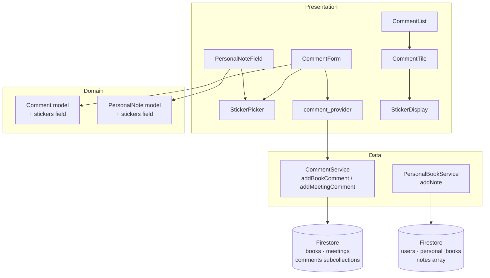
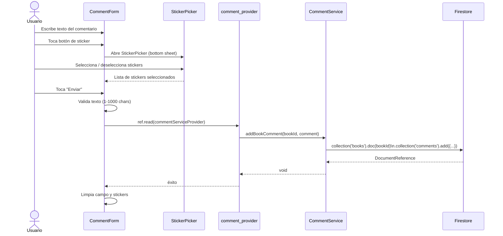
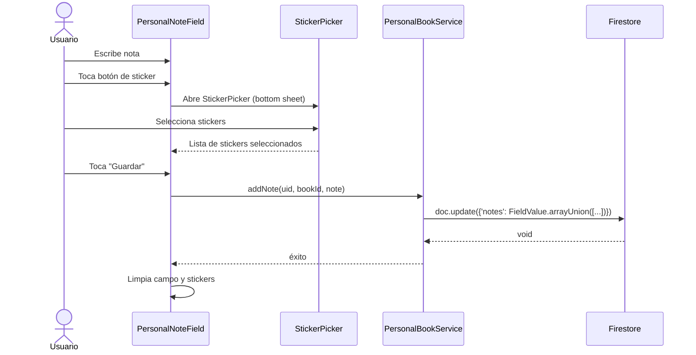

# Design Document: Comment Stickers

## Overview

Esta feature permite a los usuarios adjuntar stickers ilustrados a sus comentarios en la app Book Club. Los stickers son imágenes PNG/WebP con fondo transparente, al estilo WhatsApp/Telegram, almacenadas como assets locales en la app Flutter (`assets/stickers/`). Se seleccionan desde un picker tipo cuadrícula antes de enviar el comentario, y se persisten en Firestore como IDs de sticker (strings snake_case). La feature aplica a los tres contextos donde existen comentarios: libros del club (`books/{bookId}/comments`), libros personales (`users/{uid}/personal_books/{bookId}`) y reuniones (`meetings/{meetingId}/comments`).

El diseño extiende el modelo `Comment` existente y el widget `PersonalNoteField` con un campo opcional `stickers`, sin romper compatibilidad con comentarios ya guardados. Los stickers desconocidos (de versiones anteriores) se ignoran silenciosamente en el display. La UI sigue el design system Alquimia Literaria.

---

## Architecture



---

## Sequence Diagrams

### Agregar comentario con sticker (libro del club / reunión)



### Agregar nota con sticker (libro personal)



---

## Components and Interfaces

### Component 1: StickerPicker

**Purpose**: Widget reutilizable que muestra una cuadrícula de imágenes de stickers y permite seleccionar/deseleccionar hasta `maxStickers` (default: 5). Se presenta como un `showModalBottomSheet`. Al seleccionar un sticker se muestra un borde/overlay de selección similar a WhatsApp.

**Interface**:

```dart
class StickerPicker extends StatefulWidget {
  /// IDs de stickers ya seleccionados (para pre-marcarlos al abrir).
  final List<String> selectedStickers;

  /// Máximo de stickers seleccionables simultáneamente.
  final int maxStickers;

  /// Callback con la lista de IDs confirmados.
  final void Function(List<String> stickers) onConfirm;

  const StickerPicker({
    required this.selectedStickers,
    required this.onConfirm,
    this.maxStickers = 5,
    super.key,
  });
}
```

**Responsibilities**:

- Renderizar un `GridView` con `Image.asset(StickerCatalog.all[id]!)` para cada sticker del catálogo.
- Gestionar el estado de selección local (toggle por ID).
- Mostrar borde/overlay de selección (color primario del tema) sobre los stickers seleccionados.
- Deshabilitar (opacidad reducida) los stickers no seleccionados cuando se alcanza `maxStickers`.
- Emitir la lista de IDs confirmados vía `onConfirm`.
- Seguir el design system Alquimia (colores, border radius, tipografía).

---

### Component 2: StickerDisplay

**Purpose**: Widget de solo lectura que muestra la fila de stickers adjuntos a un comentario o nota ya guardado.

**Interface**:

```dart
class StickerDisplay extends StatelessWidget {
  /// IDs de stickers a mostrar (ej. ['sticker_heart', 'sticker_fire']).
  final List<String> stickers;

  const StickerDisplay({required this.stickers, super.key});
}
```

**Responsibilities**:

- Renderizar cada sticker como `Image.asset(StickerCatalog.all[id]!, width: 40, height: 40)` dentro de un `Wrap`.
- Ignorar silenciosamente los IDs que no existan en `StickerCatalog.all` (retrocompatibilidad con versiones anteriores).
- No mostrar nada si `stickers` está vacío o todos los IDs son desconocidos.

---

### Component 3: StickerCatalog

**Purpose**: Clase de datos que define el catálogo de stickers disponibles en la app. Centraliza el mapa `ID → ruta de asset` para que `StickerPicker`, `StickerDisplay` y cualquier validación usen la misma fuente de verdad.

**Interface**:

```dart
abstract class StickerCatalog {
  /// Mapa de ID de sticker → ruta de asset local.
  /// Los IDs son strings snake_case cortos; las rutas apuntan a assets/stickers/.
  static const Map<String, String> all = {
    'sticker_heart':  'assets/stickers/sticker_heart.png',
    'sticker_laugh':  'assets/stickers/sticker_laugh.png',
    'sticker_cry':    'assets/stickers/sticker_cry.png',
    'sticker_wow':    'assets/stickers/sticker_wow.png',
    'sticker_fire':   'assets/stickers/sticker_fire.png',
    'sticker_clap':   'assets/stickers/sticker_clap.png',
    'sticker_think':  'assets/stickers/sticker_think.png',
    'sticker_book':   'assets/stickers/sticker_book.png',
    'sticker_star':   'assets/stickers/sticker_star.png',
    'sticker_party':  'assets/stickers/sticker_party.png',
    'sticker_love':   'assets/stickers/sticker_love.png',
    'sticker_cool':   'assets/stickers/sticker_cool.png',
    'sticker_sad':    'assets/stickers/sticker_sad.png',
    'sticker_angry':  'assets/stickers/sticker_angry.png',
    'sticker_sleep':  'assets/stickers/sticker_sleep.png',
    'sticker_idea':   'assets/stickers/sticker_idea.png',
    'sticker_magic':  'assets/stickers/sticker_magic.png',
    'sticker_coffee': 'assets/stickers/sticker_coffee.png',
    'sticker_moon':   'assets/stickers/sticker_moon.png',
    'sticker_pen':    'assets/stickers/sticker_pen.png',
  };

  /// Solo los IDs, para iterar en el picker.
  static const List<String> ids = [
    'sticker_heart', 'sticker_laugh', 'sticker_cry',   'sticker_wow',
    'sticker_fire',  'sticker_clap',  'sticker_think',  'sticker_book',
    'sticker_star',  'sticker_party', 'sticker_love',   'sticker_cool',
    'sticker_sad',   'sticker_angry', 'sticker_sleep',  'sticker_idea',
    'sticker_magic', 'sticker_coffee','sticker_moon',   'sticker_pen',
  ];

  StickerCatalog._();
}
```

**Responsibilities**:

- Ser la única fuente de verdad del catálogo (ID → asset path).
- Permitir validación en el servicio: solo se persisten IDs presentes en `StickerCatalog.all.keys`.
- Proveer `ids` para que `StickerPicker` itere sin necesidad de llamar a `.keys`.

---

### Component 4: CommentForm (modificado)

**Purpose**: Extiende el `CommentForm` existente para incluir el botón de sticker y mostrar los stickers seleccionados antes de enviar.

**Cambios**:

- Agrega estado `List<String> _selectedStickers = []`.
- Agrega `IconButton` de sticker junto al campo de texto.
- Al pulsar el botón, abre `StickerPicker` vía `showModalBottomSheet`.
- Muestra `StickerDisplay` con los stickers seleccionados encima del campo (preview).
- Pasa `stickers: _selectedStickers` al construir el `Comment`.
- Limpia `_selectedStickers` tras envío exitoso.

---

### Component 5: PersonalNoteField (modificado)

**Purpose**: Extiende el `PersonalNoteField` existente con la misma lógica de stickers para notas personales.

**Cambios**:

- Agrega estado `List<String> _selectedStickers = []`.
- Agrega `IconButton` de sticker junto al botón "Guardar".
- Pasa `stickers: _selectedStickers` al construir el `PersonalNote`.
- Limpia `_selectedStickers` tras guardado exitoso.

---

### Component 6: CommentTile (modificado)

**Purpose**: Extiende el `CommentTile` existente para mostrar los stickers debajo del texto del comentario.

**Cambios**:

- Agrega `StickerDisplay(stickers: comment.stickers)` debajo del `Text(comment.text)`.
- Solo renderiza `StickerDisplay` si `comment.stickers.isNotEmpty`.

---

## Data Models

### Model 1: Comment (extendido)

```dart
class Comment {
  final String id;
  final String authorId;
  final String authorName;
  final String text;           // 1-1000 chars
  final List<String> stickers; // 0-5 IDs de StickerCatalog; default []
  final DateTime createdAt;

  const Comment({
    required this.id,
    required this.authorId,
    required this.authorName,
    required this.text,
    this.stickers = const [],
    required this.createdAt,
  });

  factory Comment.fromMap(Map<String, dynamic> map, String id) {
    return Comment(
      id: id,
      authorId: map['authorId'] as String,
      authorName: map['authorName'] as String,
      text: map['text'] as String,
      // Compatibilidad hacia atrás: campo ausente → lista vacía.
      // IDs desconocidos se incluyen tal cual; StickerDisplay los ignora.
      stickers: map['stickers'] != null
          ? List<String>.from(map['stickers'] as List)
          : [],
      createdAt: (map['createdAt'] as Timestamp).toDate(),
    );
  }

  Map<String, dynamic> toMap() {
    return {
      'authorId': authorId,
      'authorName': authorName,
      'text': text,
      if (stickers.isNotEmpty) 'stickers': stickers,
      'createdAt': Timestamp.fromDate(createdAt),
    };
  }
}
```

**Validation Rules**:

- `stickers.length <= 5`
- Cada elemento de `stickers` debe ser un ID presente en `StickerCatalog.all.keys`
- `stickers` es opcional; comentarios sin el campo son válidos (retrocompatibilidad)
- IDs desconocidos leídos de Firestore se ignoran silenciosamente en `StickerDisplay`

---

### Model 2: PersonalNote (extendido)

```dart
class PersonalNote {
  final String text;
  final List<String> stickers; // 0-5 IDs de StickerCatalog; default []
  final DateTime createdAt;

  const PersonalNote({
    required this.text,
    this.stickers = const [],
    required this.createdAt,
  });

  factory PersonalNote.fromMap(Map<String, dynamic> map) {
    return PersonalNote(
      text: map['text'] as String? ?? '',
      // IDs desconocidos se incluyen tal cual; StickerDisplay los ignora.
      stickers: map['stickers'] != null
          ? List<String>.from(map['stickers'] as List)
          : [],
      createdAt: map['createdAt'] != null
          ? (map['createdAt'] as Timestamp).toDate()
          : DateTime.now(),
    );
  }

  Map<String, dynamic> toMap() {
    return {
      'text': text,
      if (stickers.isNotEmpty) 'stickers': stickers,
      'createdAt': Timestamp.fromDate(createdAt),
    };
  }
}
```

---

## Algorithmic Pseudocode

### Algoritmo principal: Selección y persistencia de stickers

```pascal
ALGORITHM addCommentWithStickers(parentId, isBook, authorId, authorName, text, stickers)
INPUT:
  parentId    : String  -- bookId o meetingId
  isBook      : Boolean
  authorId    : String
  authorName  : String
  text        : String        -- 1..1000 chars
  stickers    : List<String>  -- 0..5 IDs de StickerCatalog.all.keys

OUTPUT: void (escribe en Firestore)

PRECONDITIONS:
  text.length >= 1 AND text.length <= 1000
  stickers.length <= 5
  FOR EACH s IN stickers: s IN StickerCatalog.all.keys

BEGIN
  // Validar texto
  IF text.isEmpty OR text.length > 1000 THEN
    RAISE ValidationError("Texto inválido")
  END IF

  // Validar stickers
  IF stickers.length > 5 THEN
    RAISE ValidationError("Máximo 5 stickers")
  END IF
  FOR EACH stickerId IN stickers DO
    IF stickerId NOT IN StickerCatalog.all.keys THEN
      RAISE ValidationError("Sticker no válido: " + stickerId)
    END IF
  END FOR

  // Construir documento
  comment ← Comment(
    id         = '',
    authorId   = authorId,
    authorName = authorName,
    text       = text.trim(),
    stickers   = stickers,   // lista de IDs, ej. ['sticker_heart', 'sticker_fire']
    createdAt  = DateTime.now()
  )

  // Persistir (solo IDs, no rutas de asset)
  IF isBook THEN
    AWAIT commentService.addBookComment(parentId, comment)
  ELSE
    AWAIT commentService.addMeetingComment(parentId, comment)
  END IF

  ASSERT comment persisted in Firestore with stickers field containing IDs only
END
```

**Postconditions**:

- El documento en Firestore contiene el campo `stickers` solo si `stickers.isNotEmpty`.
- El campo `stickers` almacena IDs (ej. `['sticker_heart']`), nunca rutas de asset.
- Comentarios existentes sin campo `stickers` siguen siendo válidos (retrocompatibilidad).

**Loop Invariants**:

- En la validación de stickers: todos los IDs procesados hasta el índice `i` pertenecen a `StickerCatalog.all.keys`.

---

### Algoritmo: Toggle de sticker en StickerPicker

```pascal
ALGORITHM toggleSticker(currentSelected, stickerId, maxStickers)
INPUT:
  currentSelected : List<String>  -- IDs de stickers actualmente seleccionados
  stickerId       : String        -- ID del sticker a togglear (ej. 'sticker_heart')
  maxStickers     : Int           -- límite máximo (default 5)

OUTPUT: newSelected : List<String>

PRECONDITIONS:
  stickerId IN StickerCatalog.all.keys
  currentSelected.length <= maxStickers

BEGIN
  IF stickerId IN currentSelected THEN
    // Deseleccionar
    newSelected ← currentSelected.remove(stickerId)
  ELSE
    // Seleccionar solo si no se alcanzó el límite
    IF currentSelected.length < maxStickers THEN
      newSelected ← currentSelected.add(stickerId)
    ELSE
      newSelected ← currentSelected  // sin cambio
    END IF
  END IF

  ASSERT newSelected.length <= maxStickers
  RETURN newSelected
END
```

**Postconditions**:

- `newSelected.length <= maxStickers` siempre.
- Si el sticker estaba seleccionado, su ID ya no está en `newSelected`.
- Si el sticker no estaba seleccionado y hay espacio, su ID está en `newSelected`.

---

## Key Functions with Formal Specifications

### `StickerPicker._toggleSticker(String stickerId)`

**Preconditions:**

- `stickerId` pertenece a `StickerCatalog.all.keys`
- `_selected.length <= maxStickers`

**Postconditions:**

- Si `stickerId` estaba en `_selected` → ya no está
- Si `stickerId` no estaba en `_selected` y `_selected.length < maxStickers` → ahora está
- Si `stickerId` no estaba en `_selected` y `_selected.length == maxStickers` → sin cambio
- `_selected.length <= maxStickers` siempre

---

### `Comment.fromMap(Map<String, dynamic> map, String id)`

**Preconditions:**

- `map` contiene claves `authorId`, `authorName`, `text`, `createdAt`
- `map['stickers']` puede estar ausente (retrocompatibilidad)

**Postconditions:**

- Retorna `Comment` válido
- Si `map['stickers']` es `null` → `comment.stickers == []`
- Si `map['stickers']` es una lista → `comment.stickers` contiene los mismos strings (IDs)
- IDs desconocidos se preservan en el modelo; `StickerDisplay` los filtra al renderizar

---

### `CommentService.addBookComment(String bookId, Comment comment)`

**Preconditions:**

- `bookId` es un ID de documento existente en `books/`
- `comment.text.length >= 1 && comment.text.length <= 1000`
- `comment.stickers.length <= 5`
- Todos los elementos de `comment.stickers` pertenecen a `StickerCatalog.all.keys`

**Postconditions:**

- Se crea un documento en `books/{bookId}/comments/` con los datos del comentario
- El campo `stickers` contiene solo IDs (ej. `['sticker_heart']`), nunca rutas de asset
- El campo `stickers` solo se incluye si `comment.stickers.isNotEmpty`
- `createdAt` se sobreescribe con `Timestamp.fromDate(DateTime.now())`

---

## Example Usage

```dart
// 1. Abrir StickerPicker desde CommentForm
void _openStickerPicker(BuildContext context) {
  showModalBottomSheet(
    context: context,
    builder: (_) => StickerPicker(
      selectedStickers: _selectedStickers,
      onConfirm: (stickerIds) {
        setState(() => _selectedStickers = stickerIds);
        Navigator.pop(context);
      },
    ),
  );
}

// 2. Construir Comment con IDs de stickers al enviar
final comment = Comment(
  id: '',
  authorId: widget.currentUserId,
  authorName: widget.currentUserName,
  text: _controller.text.trim(),
  stickers: _selectedStickers, // ej. ['sticker_heart', 'sticker_fire']
  createdAt: DateTime.now(),
);

// 3. Mostrar stickers en CommentTile usando Image.asset
Column(
  crossAxisAlignment: CrossAxisAlignment.start,
  children: [
    Text(comment.text),
    if (comment.stickers.isNotEmpty)
      StickerDisplay(stickers: comment.stickers),
  ],
)

// 4. StickerDisplay: renderiza cada ID como imagen de asset
Wrap(
  spacing: 4,
  children: stickers
      .where((id) => StickerCatalog.all.containsKey(id)) // ignora IDs desconocidos
      .map((id) => Image.asset(
            StickerCatalog.all[id]!,
            width: 40,
            height: 40,
          ))
      .toList(),
)

// 5. StickerPicker: cuadrícula de imágenes con overlay de selección
GridView.builder(
  gridDelegate: const SliverGridDelegateWithFixedCrossAxisCount(
    crossAxisCount: 5,
    mainAxisSpacing: 8,
    crossAxisSpacing: 8,
  ),
  itemCount: StickerCatalog.ids.length,
  itemBuilder: (context, index) {
    final id = StickerCatalog.ids[index];
    final isSelected = _selected.contains(id);
    final isDisabled = !isSelected && _selected.length >= maxStickers;
    return GestureDetector(
      onTap: isDisabled ? null : () => _toggleSticker(id),
      child: Stack(
        children: [
          Opacity(
            opacity: isDisabled ? 0.35 : 1.0,
            child: Image.asset(StickerCatalog.all[id]!, width: 56, height: 56),
          ),
          if (isSelected)
            Positioned.fill(
              child: DecoratedBox(
                decoration: BoxDecoration(
                  border: Border.all(
                    color: Theme.of(context).colorScheme.primary,
                    width: 2,
                  ),
                  borderRadius: BorderRadius.circular(8),
                ),
              ),
            ),
        ],
      ),
    );
  },
)

// 6. Nota personal con stickers
final note = PersonalNote(
  text: _controller.text.trim(),
  stickers: _selectedStickers,
  createdAt: DateTime.now(),
);
await personalBookService.addNote(uid, bookId, note);
```

---

## Correctness Properties

*A property is a characteristic or behavior that should hold true across all valid executions of a system — essentially, a formal statement about what the system should do. Properties serve as the bridge between human-readable specifications and machine-verifiable correctness guarantees.*

### Property 1: Consistencia del catálogo

*For any* Sticker_ID present in `StickerCatalog.ids`, that same ID SHALL also be a key in `StickerCatalog.all`, and vice versa — the two collections are always in sync.

**Validates: Requirements 1.2, 1.3**

---

### Property 2: Rutas de asset válidas

*For any* entry in `StickerCatalog.all`, the asset path value SHALL match the pattern `assets/stickers/<sticker_id>.png`.

**Validates: Requirements 1.4**

---

### Property 3: Idempotencia del toggle (doble toggle)

*For any* list of selected sticker IDs and any Sticker_ID, applying `toggleSticker` twice with the same ID SHALL return a list equivalent to the original.

**Validates: Requirements 2.3**

---

### Property 4: El toggle respeta el límite máximo

*For any* selected list of length equal to `maxStickers`, calling `toggleSticker` with an ID not already in the list SHALL leave the list unchanged (length still equals `maxStickers`).

**Validates: Requirements 2.4**

---

### Property 5: Round-trip de serialización de Comment

*For any* valid `Comment` object (with stickers list of length 0–5 containing only known Sticker_IDs), calling `Comment.fromMap(comment.toMap(), comment.id)` SHALL produce a Comment with an equivalent `stickers` list.

**Validates: Requirements 6.5**

---

### Property 6: Campo condicional en Comment.toMap()

*For any* `Comment` with an empty `stickers` list, `comment.toMap()` SHALL NOT contain the key `'stickers'`.

**Validates: Requirements 6.2**

---

### Property 7: Retrocompatibilidad en Comment.fromMap()

*For any* Firestore document map that does not contain a `'stickers'` field, `Comment.fromMap(map, id).stickers` SHALL equal `[]`.

**Validates: Requirements 6.3, 10.1**

---

### Property 8: Round-trip de serialización de PersonalNote

*For any* valid `PersonalNote` object (with stickers list of length 0–5 containing only known Sticker_IDs), calling `PersonalNote.fromMap(note.toMap())` SHALL produce a PersonalNote with an equivalent `stickers` list.

**Validates: Requirements 7.5**

---

### Property 9: Campo condicional en PersonalNote.toMap()

*For any* `PersonalNote` with an empty `stickers` list, `note.toMap()` SHALL NOT contain the key `'stickers'`.

**Validates: Requirements 7.2**

---

### Property 10: Retrocompatibilidad en PersonalNote.fromMap()

*For any* map that does not contain a `'stickers'` field, `PersonalNote.fromMap(map).stickers` SHALL equal `[]`.

**Validates: Requirements 7.3, 10.2**

---

### Property 11: StickerDisplay ignora IDs desconocidos

*For any* list of sticker IDs that includes IDs not present in `StickerCatalog.all`, `StickerDisplay` SHALL render only the subset of IDs that are known, without throwing an exception.

**Validates: Requirements 5.3, 10.3**

---

### Property 12: Solo IDs en Firestore (no rutas de asset)

*For any* `Comment` with a non-empty `stickers` list, every element in `comment.toMap()['stickers']` SHALL be a Sticker_ID (snake_case string) and SHALL NOT be an asset path (i.e., SHALL NOT start with `'assets/'`).

**Validates: Requirements 6.1, 8.1, 8.2**

---

### Property 13: Validación del límite en CommentService

*For any* `Comment` with `stickers.length > 5`, `CommentService.addBookComment` and `CommentService.addMeetingComment` SHALL throw a `ValidationError` without writing to Firestore.

**Validates: Requirements 8.3**

---

### Property 14: Validación del catálogo en CommentService

*For any* `Comment` containing a Sticker_ID not present in `StickerCatalog.all.keys`, `CommentService.addBookComment` and `CommentService.addMeetingComment` SHALL throw a `ValidationError` without writing to Firestore.

**Validates: Requirements 8.4**

---

## Error Handling

### Error Scenario 1: ID de sticker desconocido en Firestore

**Condition**: Un documento en Firestore contiene un ID de sticker que no está en `StickerCatalog.all` (datos de versión anterior o corruptos).

**Response**: `Comment.fromMap` acepta el valor tal cual (no lanza excepción). `StickerDisplay` filtra el ID desconocido con `.where((id) => StickerCatalog.all.containsKey(id))` y simplemente no lo renderiza.

**Recovery**: No se requiere acción del usuario. El sticker desconocido se omite silenciosamente en el display.

---

### Error Scenario 2: Fallo al guardar comentario con stickers

**Condition**: `CommentService.addBookComment` lanza excepción (error de red, permisos).

**Response**: El `CommentForm` captura la excepción en el bloque `catch` existente y muestra `SnackBar` con `l10n.commentSendError`.

**Recovery**: Los stickers seleccionados se mantienen en el estado del formulario para que el usuario pueda reintentar.

---

### Error Scenario 3: Límite de stickers superado en UI

**Condition**: El usuario intenta seleccionar más de 5 stickers.

**Response**: El `StickerPicker` deshabilita visualmente los stickers no seleccionados cuando `_selected.length == maxStickers`. No se puede superar el límite.

**Recovery**: El usuario debe deseleccionar un sticker antes de poder seleccionar otro.

---

## Testing Strategy

### Unit Testing Approach

- `Comment.fromMap` con campo `stickers` presente (lista de IDs), ausente y vacío.
- `Comment.toMap` verifica que `stickers` no se incluye cuando está vacío.
- `PersonalNote.fromMap` / `toMap` con los mismos casos.
- `StickerCatalog.all` no está vacío, no contiene claves duplicadas, y todas las rutas siguen el patrón `assets/stickers/*.png`.
- `StickerCatalog.ids` contiene exactamente las mismas claves que `StickerCatalog.all`.
- Función `toggleSticker` (lógica pura extraída): toggle de selección por ID, respeto del límite.
- `StickerDisplay` con IDs desconocidos: verifica que no lanza excepción y no renderiza widgets para esos IDs.
- `validateCommentText` (existente) no se ve afectada por stickers.

### Property-Based Testing Approach

**Property Test Library**: `dart_test` con generadores manuales (el ecosistema Flutter no tiene fast-check; se usan tests parametrizados).

Propiedades a verificar:

- Para cualquier lista de IDs de longitud 0-5 con elementos de `StickerCatalog.ids`, `Comment.fromMap(comment.toMap(), id).stickers` es igual a la lista original.
- Para cualquier lista de IDs, `toggleSticker(toggleSticker(list, id), id) == list` (idempotencia doble).
- Para cualquier lista de longitud `maxStickers`, `toggleSticker(list, nuevoId).length == maxStickers` (no supera el límite).
- Para cualquier lista con IDs desconocidos mezclados, `StickerDisplay` solo renderiza los IDs presentes en `StickerCatalog.all`.

### Integration Testing Approach

- `CommentForm` con stickers seleccionados: verificar que el `Comment` enviado al servicio contiene los IDs correctos (no rutas de asset).
- `CommentTile` con `comment.stickers` no vacío: verificar que `StickerDisplay` renderiza `Image.asset` para cada ID conocido.
- `PersonalNoteField` con stickers: verificar que `PersonalNote` incluye los IDs al llamar `onAddNote`.
- `StickerPicker` con `selectedStickers` pre-cargados: verificar que los stickers aparecen con overlay de selección.

---

## Performance Considerations

- El catálogo de stickers es un mapa estático en memoria (`StickerCatalog.all`); no requiere carga asíncrona.
- `StickerPicker` se construye solo cuando el usuario abre el bottom sheet (lazy).
- Los stickers se almacenan como `List<String>` de IDs cortos (ej. `'sticker_heart'`); el overhead en Firestore es mínimo (< 30 bytes por comentario).
- Las imágenes PNG/WebP se cargan desde el bundle de la app con `Image.asset`; Flutter las cachea automáticamente en memoria tras la primera carga.
- `StickerDisplay` usa `Wrap` con widgets `Image.asset` de 40×40px; el impacto en listas largas es bajo dado el tamaño fijo y el caché de Flutter.
- Se recomienda que las imágenes finales sean ≤ 50KB cada una para mantener el tamaño del bundle razonable (~20 stickers × 50KB = ~1MB adicional).

---

## Security Considerations

- **Validación en cliente**: `StickerPicker` solo permite seleccionar IDs de `StickerCatalog.ids`. El `CommentService` valida que los IDs pertenezcan a `StickerCatalog.all.keys` antes de persistir.
- **Reglas de Firestore**: Las reglas existentes que validan `text` deben extenderse para validar que `stickers` sea una lista de strings con longitud ≤ 5 (si se implementan reglas de validación de campos).
- **Retrocompatibilidad**: El campo `stickers` es opcional en Firestore; su ausencia no rompe la lectura.
- **Sin riesgo de path traversal**: Las rutas de asset se resuelven en tiempo de compilación desde `StickerCatalog.all`; el cliente nunca construye rutas dinámicas a partir de datos de Firestore.
- **Catálogo cerrado**: Solo se persisten IDs del catálogo; no hay riesgo de inyección de contenido arbitrario.

---

## Asset Structure

### Directorio de stickers

```
assets/
└── stickers/
    ├── sticker_heart.png
    ├── sticker_laugh.png
    ├── sticker_cry.png
    ├── sticker_wow.png
    ├── sticker_fire.png
    ├── sticker_clap.png
    ├── sticker_think.png
    ├── sticker_book.png
    ├── sticker_star.png
    ├── sticker_party.png
    ├── sticker_love.png
    ├── sticker_cool.png
    ├── sticker_sad.png
    ├── sticker_angry.png
    ├── sticker_sleep.png
    ├── sticker_idea.png
    ├── sticker_magic.png
    ├── sticker_coffee.png
    ├── sticker_moon.png
    └── sticker_pen.png
```

**Especificaciones de las imágenes**:

- Formato: PNG o WebP con canal alfa (fondo transparente)
- Estilo: ilustrado, al estilo WhatsApp/Telegram
- Tamaño recomendado: 256×256px (se escalan a 40px en display, 56px en picker)
- Peso máximo recomendado: 50KB por imagen
- Nombre de archivo: debe coincidir exactamente con la ruta en `StickerCatalog.all`

> **Nota de desarrollo**: Durante el desarrollo, se usarán imágenes placeholder (ej. rectángulos de color con el ID como texto) hasta que el equipo de diseño provea las imágenes PNG/WebP finales ilustradas. Las imágenes placeholder no deben incluirse en el build de producción.

### Declaración en pubspec.yaml

```yaml
flutter:
  assets:
    - assets/stickers/
```

Esta declaración incluye automáticamente todos los archivos dentro del directorio `assets/stickers/`.

---

## Dependencies

- **No se requieren dependencias nuevas** para la funcionalidad base. Los stickers se renderizan con `Image.asset()` del SDK de Flutter.
- Si en el futuro se prefiere SVG sobre PNG/WebP, se puede agregar el paquete `flutter_svg` (versión estable más reciente), pero PNG/WebP es suficiente y no requiere dependencia adicional.
- Paquetes existentes utilizados: `cloud_firestore`, `flutter_riverpod`, `flutter_localizations`.
- El `showModalBottomSheet` es parte del SDK de Flutter.
