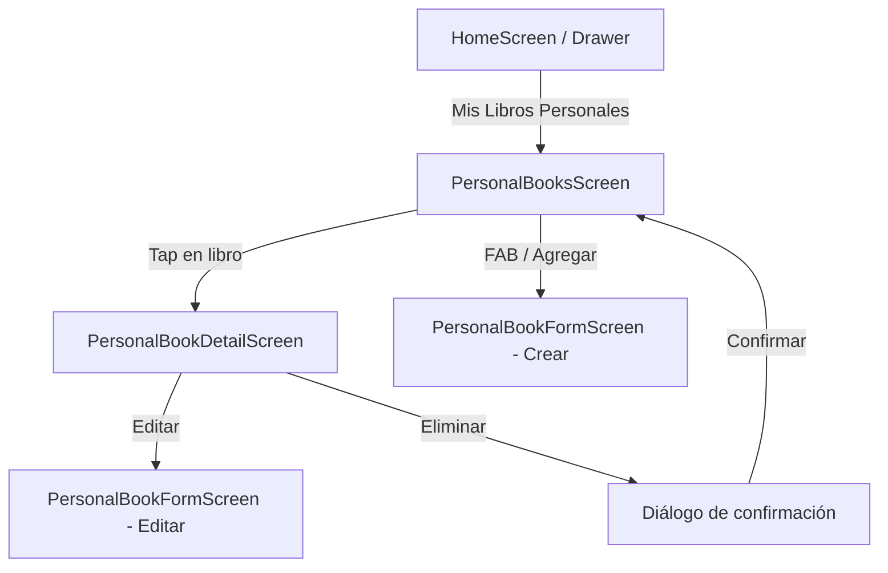
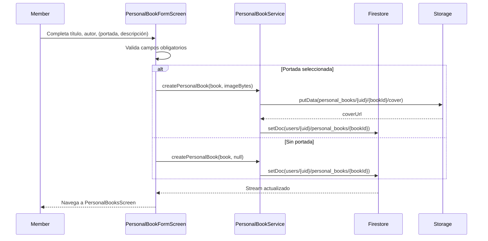

# Design Document: Mis Libros Personales (personal-books)

## Overview

La funcionalidad **Mis Libros Personales** permite a cada miembro del club llevar un registro completamente privado de sus propias lecturas, independiente del catálogo compartido del club. A diferencia de la sección "Mi Biblioteca" (que categoriza libros del club), esta feature permite al usuario **crear sus propios libros** con título, autor, portada, descripción, notas personales, estado de lectura y calificación privada.

### Distinción clave con la feature existente "Mi Biblioteca"

| Característica | Mi Biblioteca (`library`) | Mis Libros Personales (`personal_books`) |
|---|---|---|
| Origen del libro | Catálogo del club | Creado por el propio usuario |
| Datos del libro | Referencia a `books/{bookId}` | Documento autónomo en `users/{uid}/personal_books` |
| Portada | La del club | Subida por el usuario (opcional) |
| Notas | No | Sí (hasta 5000 chars) |
| Calificación | No | Sí (1–5, solo cuando `status=read`) |
| Visibilidad | Solo el usuario | Solo el usuario |

### Stack tecnológico (heredado del proyecto)

- **Frontend**: Flutter (Dart) con Riverpod para gestión de estado
- **Base de datos**: Cloud Firestore — subcolección `users/{uid}/personal_books`
- **Almacenamiento**: Firebase Storage — ruta `personal_books/{uid}/{bookId}/cover`
- **Navegación**: go_router
- **i18n**: flutter_localizations (español e inglés)
- **Testing de propiedades**: `glados` (Dart PBT library)

---

## Architecture

La feature sigue la misma arquitectura en capas del resto de la app:

```
┌─────────────────────────────────────────────────────────┐
│                   Presentation Layer                     │
│  PersonalBooksScreen, PersonalBookDetailScreen,          │
│  PersonalBookFormScreen                                  │
│  Providers: personalBooksProvider, personalBookProvider  │
├─────────────────────────────────────────────────────────┤
│                    Domain Layer                          │
│  PersonalBook (model)                                    │
│  PersonalBookStatus (constants)                          │
├─────────────────────────────────────────────────────────┤
│                     Data Layer                           │
│  PersonalBookService (Firestore + Storage)               │
└─────────────────────────────────────────────────────────┘
```

### Flujo de navegación



### Flujo de creación de Personal_Book



---

## Components and Interfaces

### Servicio de datos

#### PersonalBookService

```dart
// lib/data/services/personal_book_service.dart
class PersonalBookService {
  // Escucha en tiempo real todos los libros personales del usuario,
  // ordenados por updatedAt descendente.
  Stream<List<PersonalBook>> watchPersonalBooks(String uid);

  // Escucha libros personales filtrados por status.
  Stream<List<PersonalBook>> watchPersonalBooksByStatus(
    String uid,
    String status,
  );

  // Obtiene un libro personal por ID (lectura única).
  Future<PersonalBook?> getPersonalBook(String uid, String bookId);

  // Crea un nuevo libro personal. Si imageBytes != null, sube la portada
  // a Storage antes de guardar el documento.
  Future<String> createPersonalBook(
    String uid,
    PersonalBook book,
    Uint8List? imageBytes,
    String? imageFileName,
  );

  // Actualiza únicamente los campos proporcionados + updatedAt.
  Future<void> updatePersonalBook(
    String uid,
    String bookId,
    Map<String, dynamic> fields,
  );

  // Elimina el documento y, si existe, la imagen de portada en Storage.
  Future<void> deletePersonalBook(String uid, String bookId);

  // Sube una nueva portada y devuelve la URL.
  Future<String> uploadCover(
    String uid,
    String bookId,
    Uint8List bytes,
    String fileName,
  );
}
```

### Providers (Riverpod)

```dart
// lib/presentation/providers/personal_book_provider.dart

// Servicio
final personalBookServiceProvider = Provider<PersonalBookService>(
  (ref) => PersonalBookService(),
);

// Stream de todos los libros personales del usuario autenticado
final personalBooksStreamProvider = StreamProvider<List<PersonalBook>>((ref) {
  final user = ref.watch(authStateProvider).valueOrNull;
  if (user == null) return const Stream.empty();
  return ref.watch(personalBookServiceProvider).watchPersonalBooks(user.uid);
});

// Stream filtrado por status
final personalBooksByStatusProvider =
    StreamProvider.family<List<PersonalBook>, String>((ref, status) {
  final user = ref.watch(authStateProvider).valueOrNull;
  if (user == null) return const Stream.empty();
  return ref
      .watch(personalBookServiceProvider)
      .watchPersonalBooksByStatus(user.uid, status);
});

// Libro personal individual (para la pantalla de detalle)
final personalBookStreamProvider =
    StreamProvider.family<PersonalBook?, String>((ref, bookId) {
  final user = ref.watch(authStateProvider).valueOrNull;
  if (user == null) return const Stream.empty();
  return ref
      .watch(personalBookServiceProvider)
      .watchPersonalBook(user.uid, bookId);
});
```

### Pantallas

| Pantalla | Ruta | Descripción |
|---|---|---|
| `PersonalBooksScreen` | `/personal-books` | Listado con filtros por status |
| `PersonalBookDetailScreen` | `/personal-books/:id` | Detalle, notas y calificación |
| `PersonalBookFormScreen` | `/personal-books/create` y `/personal-books/:id/edit` | Formulario reutilizable |

### Widgets nuevos

| Widget | Ubicación | Descripción |
|---|---|---|
| `PersonalBookCard` | `widgets/personal_book/` | Tarjeta en el listado |
| `PersonalBookStatusChip` | `widgets/personal_book/` | Chip de estado (want_to_read / reading / read) |
| `PersonalBookStatusFilter` | `widgets/personal_book/` | Filtro de status en la pantalla de listado |
| `PersonalNoteField` | `widgets/personal_book/` | Campo de notas con contador de caracteres |
| `PersonalRatingWidget` | `widgets/personal_book/` | Control de calificación (1–5 estrellas) |

---

## Data Models

### PersonalBook

```dart
// lib/domain/models/personal_book.dart
class PersonalBook {
  final String id;
  final String userId;
  final String title;
  final String author;
  final String? description;
  final String? coverUrl;
  final String status; // PersonalBookStatus constant
  final String? notes;       // máx. 5000 chars
  final int? rating;         // 1–5, solo cuando status == 'read'
  final DateTime createdAt;
  final DateTime updatedAt;
  final DateTime? startedAt;   // se registra al pasar a 'reading'
  final DateTime? finishedAt;  // se registra al pasar a 'read'

  const PersonalBook({
    required this.id,
    required this.userId,
    required this.title,
    required this.author,
    this.description,
    this.coverUrl,
    required this.status,
    this.notes,
    this.rating,
    required this.createdAt,
    required this.updatedAt,
    this.startedAt,
    this.finishedAt,
  });

  factory PersonalBook.fromMap(
    Map<String, dynamic> map,
    String id,
    String userId,
  );

  Map<String, dynamic> toMap();
}
```

### PersonalBookStatus

```dart
// lib/domain/models/personal_book.dart (mismo archivo)
class PersonalBookStatus {
  static const wantToRead = 'want_to_read';
  static const reading = 'reading';
  static const read = 'read';

  static const all = [wantToRead, reading, read];

  PersonalBookStatus._();
}
```

### Estructura Firestore

```
users/{uid}/personal_books/{bookId}
  userId        : String
  title         : String
  author        : String
  description   : String?
  coverUrl      : String?
  status        : String  ('want_to_read' | 'reading' | 'read')
  notes         : String?  (máx. 5000 chars)
  rating        : int?     (1–5, solo cuando status == 'read')
  createdAt     : Timestamp
  updatedAt     : Timestamp
  startedAt     : Timestamp?
  finishedAt    : Timestamp?
```

### Estructura Firebase Storage

```
personal_books/{uid}/{bookId}/cover
```

### Reglas de seguridad Firestore (adición a firestore.rules)

```javascript
// Subcolección personal_books: solo el propio usuario puede leer/escribir
match /users/{userId}/personal_books/{bookId} {
  allow read, write: if request.auth != null
                     && request.auth.uid == userId;
}
```

### Reglas de seguridad Storage (adición a storage.rules)

```javascript
// Portadas de libros personales: solo el propio usuario
match /personal_books/{userId}/{allPaths=**} {
  allow read, write: if request.auth != null
                     && request.auth.uid == userId;
}
```

### Integración con la navegación existente

Se añade la entrada "Mis Libros Personales" al `Drawer` de `HomeScreen` (visible para todos los miembros activos) y se registran las nuevas rutas en `app_router.dart`:

```dart
// Nuevas constantes en AppRoutes
static const personalBooks = '/personal-books';
static const createPersonalBook = '/personal-books/create';
static const personalBookDetailPath = '/personal-books/:id';
static String personalBookDetail(String id) => '/personal-books/$id';
static String editPersonalBook(String id) => '/personal-books/$id/edit';
static const editPersonalBookPath = '/personal-books/:id/edit';
```

---

## Correctness Properties

*Una propiedad es una característica o comportamiento que debe mantenerse verdadero en todas las ejecuciones válidas del sistema — esencialmente, una declaración formal sobre lo que el sistema debe hacer. Las propiedades sirven como puente entre las especificaciones legibles por humanos y las garantías de corrección verificables por máquinas.*

### Property Reflection (análisis de redundancias)

Antes de escribir las propiedades finales, se identifican redundancias:

- **2.2 y 3.4** prueban la misma regla de validación (title/author vacíos rechazados). Se combinan en una sola propiedad.
- **6.2 y 6.3** prueban la misma regla de longitud de notas. Se combinan en una sola propiedad.
- **3.1** (actualización parcial) y **2.1** (creación con campos completos) son propiedades distintas y complementarias — se mantienen separadas.
- **7.2** (upsert de rating) y **7.3** (rechazo de rating en libros no leídos) son propiedades distintas — se mantienen separadas.
- **5.1** (ordenación) y **5.2** (filtrado por status) son propiedades distintas — se mantienen separadas.

Propiedades finales: **8 propiedades** (eliminando redundancias de 2.2/3.4 y 6.2/6.3).

---

### Property 1: Aislamiento de libros personales por usuario

*Para cualquier* conjunto de documentos en `users/{uid}/personal_books`, el stream `watchPersonalBooks(uid)` debe retornar únicamente los documentos cuyo `userId` sea igual a `uid`, sin importar cuántos usuarios distintos tengan libros personales en la base de datos.

**Validates: Requirements 1.2**

---

### Property 2: Creación de Personal_Book preserva todos los campos requeridos

*Para cualquier* par válido de `(title, author)` (cadenas no vacías), al crear un `PersonalBook`, el documento almacenado en `users/{uid}/personal_books` debe contener exactamente los campos: `title`, `author`, `status` (valor `'want_to_read'`), `createdAt` y `updatedAt`, con los valores correspondientes a los datos de entrada.

**Validates: Requirements 2.1**

---

### Property 3: Validación de campos obligatorios (title y author)

*Para cualquier* cadena compuesta únicamente de espacios en blanco o vacía usada como `title` o `author`, el sistema debe rechazar el envío del formulario y no crear ni modificar ningún documento en Firestore.

**Validates: Requirements 2.2, 3.4**

---

### Property 4: Actualización parcial preserva campos no modificados

*Para cualquier* `PersonalBook` existente y cualquier subconjunto de campos a actualizar, la operación `updatePersonalBook` debe modificar únicamente los campos incluidos en el mapa de actualización más el campo `updatedAt`, dejando intactos todos los demás campos del documento.

**Validates: Requirements 3.1**

---

### Property 5: Transiciones de estado registran timestamps correctos

*Para cualquier* `PersonalBook`, cuando su `status` cambia a `'read'`, el documento debe contener `finishedAt` con una fecha igual o posterior a `createdAt`. Cuando su `status` cambia a `'reading'` y `startedAt` no existía previamente, el documento debe contener `startedAt` con una fecha igual o posterior a `createdAt`. Si `startedAt` ya existía, no debe ser sobreescrito.

**Validates: Requirements 3.2, 3.3**

---

### Property 6: Listado ordenado por updatedAt descendente

*Para cualquier* colección de `PersonalBooks` de un usuario, la lista retornada por `watchPersonalBooks(uid)` debe estar ordenada de forma que para todo par de libros adyacentes `(a, b)`, se cumpla `a.updatedAt >= b.updatedAt`.

**Validates: Requirements 5.1**

---

### Property 7: Filtrado por status retorna solo libros con ese status

*Para cualquier* conjunto de `PersonalBooks` con statuses mixtos y cualquier valor de filtro `s ∈ {want_to_read, reading, read}`, el stream `watchPersonalBooksByStatus(uid, s)` debe retornar únicamente los libros cuyo `status == s`.

**Validates: Requirements 5.2**

---

### Property 8: Validación de longitud de notas

*Para cualquier* cadena de texto, el sistema debe aceptar el guardado de notas si y solo si su longitud está en el rango `[0, 5000]` caracteres. Cadenas con más de 5000 caracteres deben ser rechazadas sin modificar el documento en Firestore.

**Validates: Requirements 6.2, 6.3**

---

### Property 9: Upsert de calificación garantiza exactamente un valor por libro

*Para cualquier* `PersonalBook` con `status == 'read'` e independientemente de cuántas veces se guarde una calificación, el campo `rating` del documento debe contener exactamente el último valor enviado (entero entre 1 y 5), y `updatedAt` debe reflejar la fecha de la última actualización.

**Validates: Requirements 7.2**

---

### Property 10: Calificación rechazada para libros no leídos

*Para cualquier* `PersonalBook` con `status` distinto de `'read'` (`want_to_read` o `reading`), cualquier intento de guardar una calificación debe ser rechazado y el campo `rating` del documento no debe ser modificado.

**Validates: Requirements 7.3**

---

## Error Handling

### Errores de validación (capa de presentación)

- **title o author vacíos**: error inline en el campo del formulario; no se envía la petición.
- **notes > 5000 chars**: contador de caracteres visible en tiempo real; botón de guardar deshabilitado; mensaje de error inline.
- **rating en libro no leído**: mensaje informativo en `SnackBar`; control de calificación oculto/deshabilitado.

### Errores de red / Firestore

- **Timeout o sin conexión**: `SnackBar` con mensaje descriptivo. No bloquear navegación.
- **Permiso denegado**: mensaje "No tienes permisos para esta acción". Esto no debería ocurrir en condiciones normales dado que las reglas de Firestore solo permiten al propio usuario acceder a sus datos.

### Errores de Storage

- **Fallo al subir portada**: mostrar error y no crear el documento hasta que la imagen se suba correctamente. El usuario puede reintentar o continuar sin portada.
- **Fallo al eliminar portada**: registrar el error en consola pero continuar con la eliminación del documento (la portada huérfana puede limpiarse posteriormente).

### Errores de eliminación

- **Documento no encontrado**: tratar como éxito silencioso (idempotente).
- **Error de Firestore**: mostrar `SnackBar` de error; no cerrar el diálogo de confirmación.

---

## Testing Strategy

### Enfoque dual: Unit Tests + Property-Based Tests

La estrategia combina tests de ejemplo para casos concretos y tests de propiedades para verificar invariantes universales.

#### Librería de Property-Based Testing

Se utilizará **`glados`** (pub.dev/packages/glados) como librería de PBT para Dart/Flutter, consistente con el resto del proyecto. Cada test de propiedad se ejecutará con un mínimo de **100 iteraciones**.

#### Unit Tests (tests de ejemplo)

Se escribirán tests de ejemplo para:

- Navegación: entrada "Mis Libros Personales" visible en el drawer para miembros activos.
- Stream en tiempo real: crear un libro personal actualiza el stream sin recarga manual.
- Stream en tiempo real: eliminar un libro personal actualiza el stream sin recarga manual.
- Diálogo de confirmación: la acción de eliminar muestra el diálogo antes de ejecutar.
- Estado vacío: lista vacía muestra el widget de estado vacío con acción de agregar.
- Navegación a detalle: tap en tarjeta navega a `PersonalBookDetailScreen`.
- Carga: mientras el stream está cargando, se muestra `CircularProgressIndicator`.
- Error de red: error en Firestore muestra mensaje descriptivo sin bloquear navegación.
- Notas: detalle muestra notas actuales en campo editable.
- Calificación visible: detalle de libro `read` muestra control de calificación.
- Calificación oculta: detalle de libro `reading` o `want_to_read` no muestra control de calificación.

#### Property-Based Tests

Cada propiedad del documento se implementará como un test de propiedad con la siguiente convención de etiquetado:

```dart
// Feature: personal-books, Property 1: Aislamiento de libros personales por usuario
test('watchPersonalBooks only returns books for the given uid', () {
  Glados<List<PersonalBook>>().test((books) {
    // ...
  });
});
```

**Propiedades a implementar como PBT:**

| Property | Descripción | Tipo de test |
|---|---|---|
| P1 | Aislamiento por usuario | Property |
| P2 | Creación preserva campos requeridos | Property |
| P3 | Validación de campos obligatorios | Property |
| P4 | Actualización parcial preserva campos | Property |
| P5 | Transiciones de estado registran timestamps | Property |
| P6 | Listado ordenado por updatedAt desc | Property |
| P7 | Filtrado por status | Property |
| P8 | Validación longitud de notas | Property |
| P9 | Upsert de calificación (uno por libro) | Property |
| P10 | Calificación rechazada para no leídos | Property |

#### Integration / Smoke Tests

- Reglas de seguridad Firestore (Requirements 1.3, 8.1): smoke tests con Firebase Emulator Suite — verificar que usuario B no puede leer/escribir `users/{uidA}/personal_books`.
- Reglas de seguridad Storage (Requirement 8.2): smoke test con Storage Emulator — verificar que usuario B no puede acceder a `personal_books/{uidA}/`.
- Subida de portada a Storage (Requirement 2.3): integration test con Storage Emulator — crear libro con portada, verificar que `coverUrl` apunta a la ruta correcta.
- Eliminación con portada (Requirement 4.1): integration test — eliminar libro con portada, verificar que el archivo en Storage también se elimina.
- Aislamiento en pantallas del club (Requirement 8.3): smoke test / revisión de código — verificar que ninguna query del club toca la subcolección `personal_books`.

### Estructura de archivos de test

```
test/
├── data/
│   └── services/
│       └── personal_book_service_test.dart   # Unit + PBT
├── domain/
│   └── models/
│       └── personal_book_test.dart           # fromMap/toMap round-trip
└── presentation/
    ├── providers/
    │   └── personal_book_provider_test.dart  # Provider tests
    └── screens/
        └── personal_books_screen_test.dart   # Widget tests (ejemplos)
```
